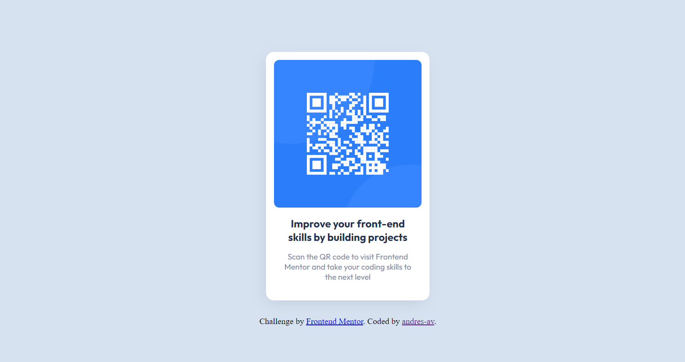

# Frontend Mentor - QR code component solution

This is a solution to the [QR code component challenge on Frontend Mentor](https://www.frontendmentor.io/challenges/qr-code-component-iux_sIO_H). Frontend Mentor challenges help you improve your coding skills by building realistic projects.

## Table of contents

- [Overview](#overview)
  - [Screenshot](#screenshot)
  - [Links](#links)
- [My process](#my-process)
  - [Built with](#built-with)
  - [What I learned](#what-i-learned)
  - [Continued development](#continued-development)
- [Author](#author)

## Overview

This is the first challenge on Front-End Mentor, a QR code card to be styled on css.

This is a beginner level challenge that includes only the usage of html and css.

### Screenshot

### Links

- Solution URL: [https://www.frontendmentor.io/solutions/qr-code-card-created-with-html-and-css-PeTCBvehDX](https://www.frontendmentor.io/solutions/qr-code-card-created-with-html-and-css-PeTCBvehDX)
- Live Site URL: [https://andres-av.github.io/QR-Code-Component/](https://andres-av.github.io/QR-Code-Component/)

## My process

### Built with

- Semantic HTML5 markup
- CSS custom properties
- Flexbox

### What I learned

This was a good practice to begin taking the front-end Mentor Challenges.

However I had a good practice on how to link my VS code with github repositories and how to create and edit README files, which is something I was not very familiar with.

### Continued development

My next step for this challenge is to enable a live page example by deploying it with github pages, netlify or any other hosting services platform.

## Author

- Website - [Andres Abarca](https://github.com/andres-av)
- Frontend Mentor - [@andres-av](https://www.frontendmentor.io/profile/andres-av)
- LinkedIn - [Andres Abarca](https://www.linkedin.com/in/andres-abarca)
